# Documentation Structure

Scaffolds and maintains a structured `docs/` directory for any project. Creates the folder hierarchy, applies naming conventions, generates documents from templates, and sets up architecture context files.

Request: $ARGUMENTS

## When to Use

- **Setup**: Scaffold full `docs/` structure (including `architecture/`) in a new or existing repo
- **Maintenance**: Add new feature docs, release notes, testing plans, meeting notes, research, reviews, guides, design specs, or architecture context files
- **Audit**: Verify existing docs follow conventions (naming, frontmatter, structure)

---

## Directory Structure

```
docs/
├── architecture/      # Project-level architecture context (see Architecture Layer below)
│   ├── overview.md            # Master doc: product overview, route map, design system, changelog
│   ├── system.md              # System architecture, data flow, layer responsibilities
│   ├── api.md                 # API routes, endpoints, procedure types, error types
│   ├── data-models.md         # DB schema, entity relationships, conventions, migrations
│   ├── features.md            # Feature catalog with flows and key files
│   ├── integrations.md        # Third-party services, SDKs, and integration checklist
│   ├── security.md            # Auth flow, authorization layers, RBAC, input validation
│   └── user-journeys.md       # User flows, admin journeys, error states
├── design/            # Design specifications and style guides
├── features/          # Technical feature docs and architecture
├── guides/            # Implementation guides and case studies
├── ideas/             # Brainstorming and feature ideas
├── meetings/          # Meeting notes and recordings
├── plans/             # Roadmaps, implementation plans, and project plans
├── releases/          # Changelog and release notes
├── research/          # Competitive research and UX analysis
├── reviews/           # Code/design review documents
└── testing/           # Testing plans with screenshots
    └── {feature}/
        ├── {feature}.md
        └── screenshots/
```

---

## Naming Conventions

| Folder | Pattern | Example |
|--------|---------|---------|
| architecture | `{topic}.md` (fixed set, see below) | `system.md`, `api.md` |
| design | `{style-or-spec-name}.md` | `luxury-editorial-style.md` |
| features | `{feature}.md` or `{feature}-architecture.md` | `analytics.md`, `auth-architecture.md` |
| guides | `{topic}-guide.md` or `{topic}-{guide-type}-guide.md` | `design-system-refactoring-guide.md` |
| ideas | `kebab-case.md` | `feature-brainstorm.md` |
| meetings | `YYYY-MM-DD-description.md` (or `.csv`) | `2026-01-24-kickoff.md` |
| plans | `{feature}-implementation.md` | `auth-implementation.md` |
| releases | `YYYY-MM-DD-{title}.md` or `vX.Y.Z.md` | `2026-02-07-auth-release.md` |
| research | `{topic}-research.md` | `competitor-ux-research.md` |
| reviews | `{review-type}-{subject}.md` | `principal-review-auth.md` |
| testing | `{feature}/{feature}.md` | `auth/auth.md` |

General rules:
- All names use **kebab-case**
- All markdown files use `.md` extension
- Empty directories include a `.gitkeep` file

---

## Frontmatter (REQUIRED)

Every document **MUST** include YAML frontmatter with at least `title` and `date`:

```yaml
---
title: Human-Readable Title
date: YYYY-MM-DD
---
```

Use **today's date** when creating new documents.

---

## Setup Mode

When scaffolding docs infrastructure for a project, create the full directory tree and architecture files:

```bash
# Create all docs folders
mkdir -p docs/{architecture,design,features,guides,ideas,meetings,plans,releases,research,reviews,testing}
touch docs/ideas/.gitkeep docs/meetings/.gitkeep docs/plans/.gitkeep docs/research/.gitkeep docs/testing/.gitkeep
```

Then create all architecture files using the templates in the **Architecture Layer** section below.

---

## Architecture Layer

The `docs/architecture/` directory is a set of **living context documents** that describe the project's architecture. These are visual-first (Mermaid diagrams lead, tables reference, prose is minimal). They serve as the single source of truth for how the system is built.

### When to Update Architecture Files

| Event | Update |
|-------|--------|
| New API routes added | `api.md` |
| Schema/migration changes | `data-models.md` |
| New feature shipped | `features.md` + `overview.md` changelog |
| New third-party service | `integrations.md` |
| Auth/security changes | `security.md` |
| New user flows | `user-journeys.md` |
| Architectural refactor | `system.md` + `overview.md` |
| Any significant release | `overview.md` changelog section |

### Architecture File Templates

#### overview.md — Master Architecture Document

This is the **living high-level document** that provides a bird's-eye view of the entire project. It includes the product overview, route map, design system, and a running changelog.

```markdown
---
title: High-Level Architecture
date: YYYY-MM-DD
---

# Project Name Architecture

> Living document — updated with each significant change.

## Product Overview

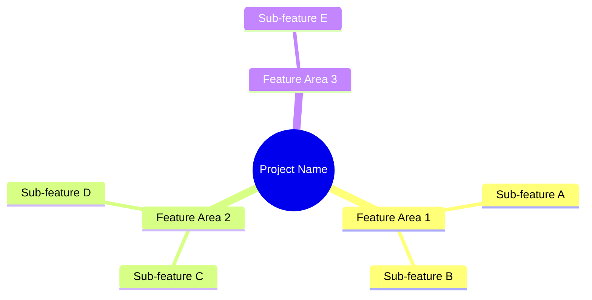

## Route Map

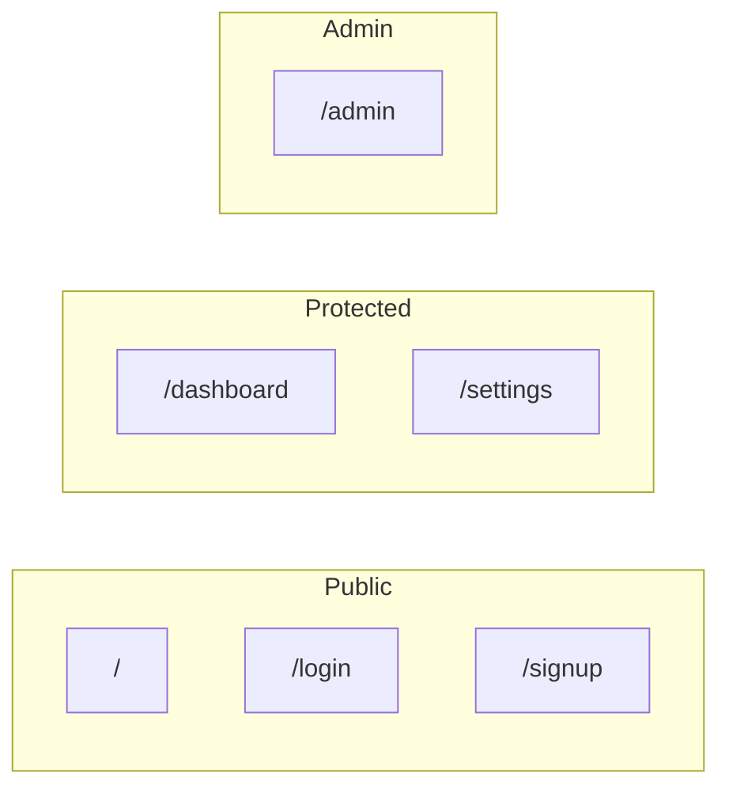

## Information Architecture

| Route | Purpose | Auth | Layout |
|-------|---------|------|--------|
| `/` | Landing page | Public | Marketing |
| `/dashboard` | Main app | Required | App |
| `/admin` | Admin panel | Admin only | Admin |

## Feature Flows

### Feature Name

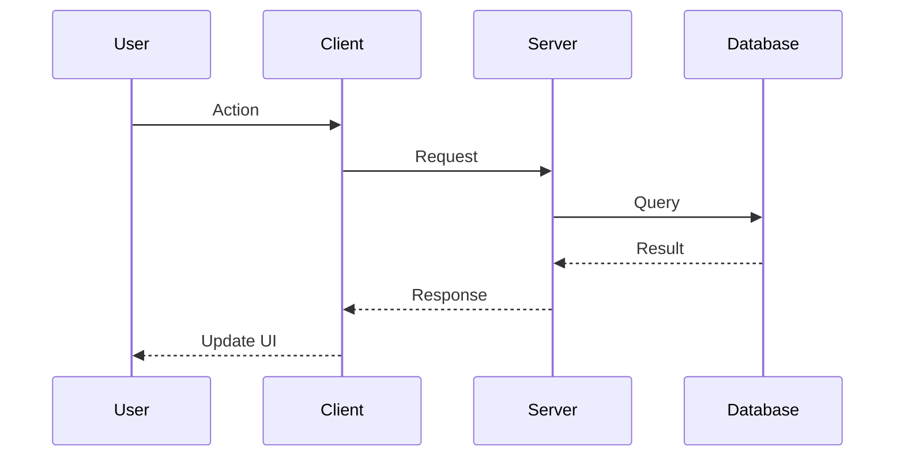

**Capabilities:**
- Capability 1
- Capability 2

## Data Relationships

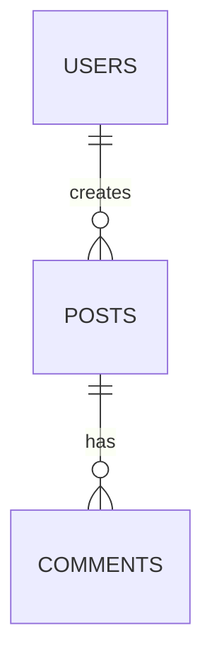

## Design System

### Design Philosophy
Core visual principles.

### Typography
Font families, scale, and hierarchy.

### Color System
Primary, semantic, and brand color definitions.

## Key Technical Decisions

| Decision | Choice | Rationale |
|----------|--------|-----------|
| Framework | React Router v7 | SSR + file-based routing |
| Database | D1 + Drizzle | Edge-native SQLite |

## Changelog

### YYYY-MM-DD — Feature Title
**Type:** feat | fix | refactor
**Summary:** What changed and why.
**Key Changes:**
- Change 1
- Change 2
```

#### system.md — System Architecture

```markdown
---
title: System Architecture
date: YYYY-MM-DD
---

# System Architecture

## Overview

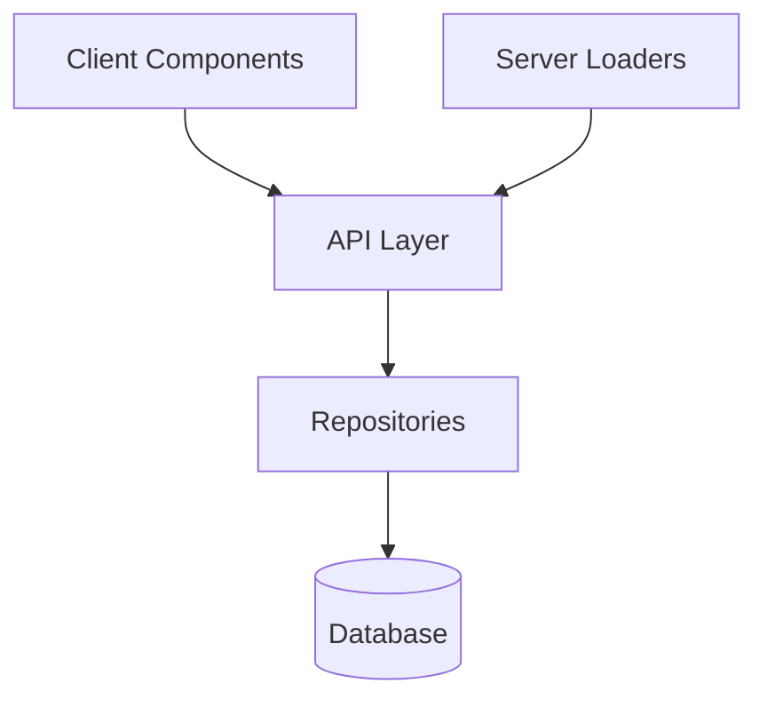

## Data Flow Patterns

### Server-Side Rendering

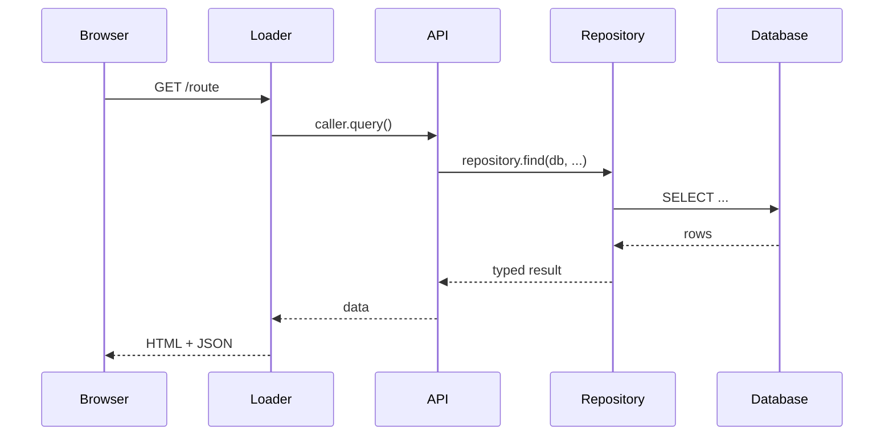

### Client-Side Mutations

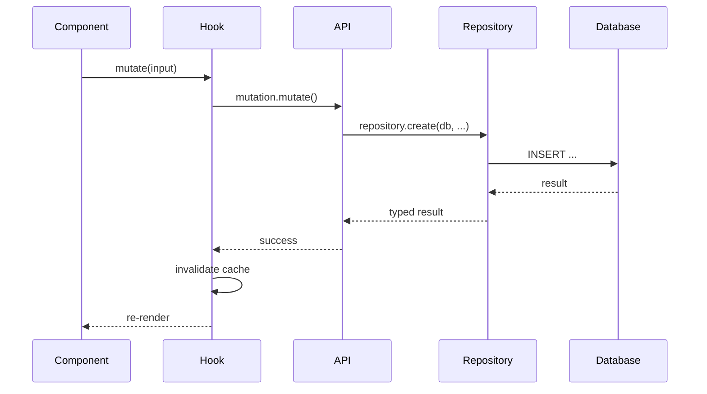

## Layer Responsibilities

| Layer | Location | Responsibility |
|-------|----------|----------------|
| Routes/Pages | `app/routes/` | UI rendering, loader data fetching |
| API | `app/api/` | Input validation, auth checks, orchestration |
| Repositories | `app/repositories/` | Data access, business logic, error handling |
| Schema | `app/db/schema.ts` | Database table definitions |

## Key Files

| Purpose | File |
|---------|------|
| API entry | `app/api/router.ts` |
| DB schema | `app/db/schema.ts` |
| Auth config | `app/auth/` |
```

#### api.md — API Reference

```markdown
---
title: API Reference
date: YYYY-MM-DD
---

# API Reference

## Request Flow

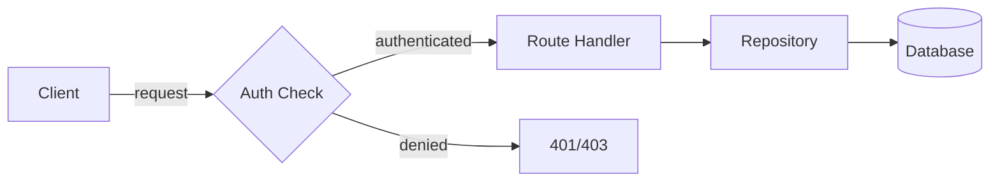

## Routes

| Route | Type | Auth | Description |
|-------|------|------|-------------|
| `resource.list` | query | user | List all resources |
| `resource.get` | query | user | Get resource by ID |
| `resource.create` | mutation | user | Create a new resource |
| `resource.update` | mutation | user | Update a resource |
| `resource.delete` | mutation | admin | Delete a resource |

## Procedure Types

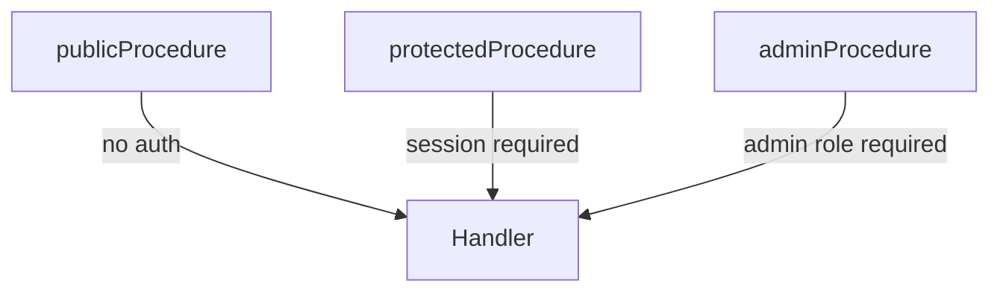

## Auth Endpoints

| Endpoint | Method | Description |
|----------|--------|-------------|
| `/api/auth/sign-in` | POST | Email/password sign in |
| `/api/auth/sign-up` | POST | Create account |
| `/api/auth/sign-out` | POST | End session |

## Context Object

```typescript
interface Context {
  db: Database;
  auth: { user: User; session: Session };
  env: Environment;
}
```

## Error Types

| Error | Code | Use Case |
|-------|------|----------|
| NotFoundError | 404 | Resource doesn't exist |
| ValidationError | 400 | Invalid input |
| CreationError | 500 | Failed to create |
| UpdateError | 500 | Failed to update |
| DeletionError | 500 | Failed to delete |
```

#### data-models.md — Data Models

```markdown
---
title: Data Models
date: YYYY-MM-DD
---

# Data Models

## Schema Location

All schemas defined in `app/db/schema.ts`

## Entity Relationships

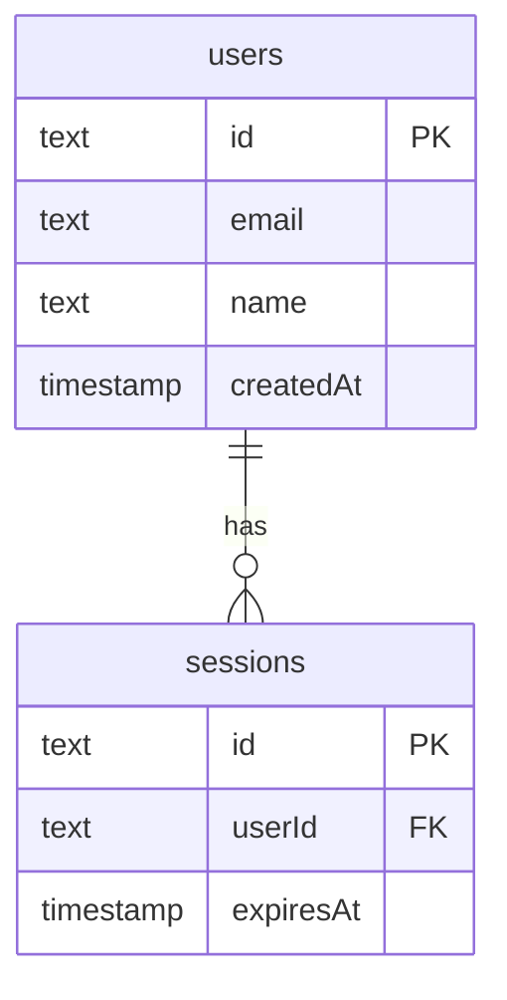

## Tables Overview

### Core Tables

| Table | Purpose | Key Relations |
|-------|---------|---------------|
| `users` | User accounts | Has sessions, has posts |
| `sessions` | Auth sessions | Belongs to user |

### Feature Tables

| Table | Purpose | Key Fields |
|-------|---------|------------|
| `posts` | User content | `title`, `body`, `userId` |

## Database Conventions

| Type | Storage | Example |
|------|---------|---------|
| Timestamps | `integer` (ms) | `integer("created_at", { mode: "timestamp_ms" })` |
| Booleans | `integer` | `integer("active", { mode: "boolean" })` |
| JSON | `text` | `text("metadata", { mode: "json" }).$type<T>()` |
| IDs | `text` | `text("id").primaryKey()` |

## Migrations

Migration files in `drizzle/` directory. Generate with schema change tooling, apply locally then remotely.
```

#### features.md — Feature Catalog

```markdown
---
title: Features
date: YYYY-MM-DD
---

# Features

## Feature Name

One-line summary of the feature.

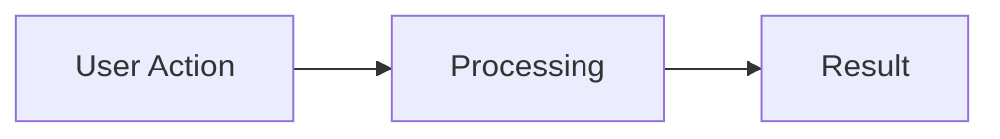

**Capabilities:**
- Capability 1
- Capability 2
- Capability 3

**Key files:** `app/routes/feature.tsx`, `app/api/feature.ts`, `app/repositories/feature.ts`

---

## Another Feature

One-line summary.

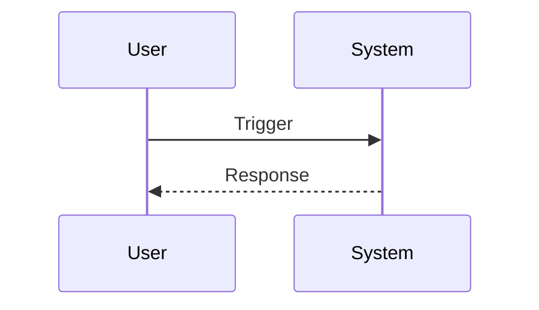

**Capabilities:**
- Capability 1
- Capability 2

**Key files:** `relevant/file/paths`

---

(Repeat for each feature. Keep entries concise — 10-20 lines each. Use Mermaid diagrams for flows.)
```

#### integrations.md — Third-Party Integrations

```markdown
---
title: Third-Party Integrations
date: YYYY-MM-DD
---

# Third-Party Integrations

## Integration Map

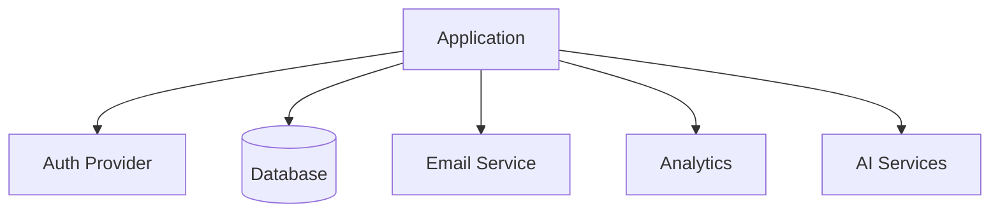

## Platform Services

| Service | Purpose | Access |
|---------|---------|--------|
| Database | Primary data store | ORM context |
| Auth | Authentication | Auth middleware |

## External Services

| Service | Purpose | SDK |
|---------|---------|-----|
| Email provider | Transactional email | `sdk-package` |
| Analytics | Product analytics | `sdk-package` |

### Service Name

| Location | Purpose |
|----------|---------|
| `app/lib/service.ts` | Client initialization |
| `app/api/webhooks/service.ts` | Webhook handler |

```typescript
// Usage pattern
import { client } from "@/lib/service";
await client.action({ params });
```

## Integration Checklist

When adding a new integration:
1. Add environment variable to platform config
2. Create client wrapper in `app/lib/`
3. Add to API context if used in routes
4. Document in this file
5. Add to environment type definitions
```

#### security.md — Security Model

```markdown
---
title: Security Model
date: YYYY-MM-DD
---

# Security Model

## Authentication Flow

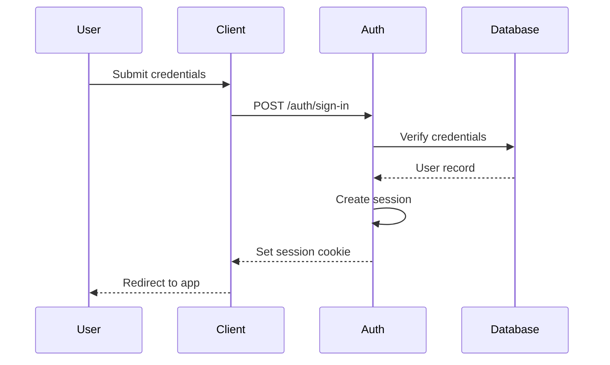

## Authorization Layers

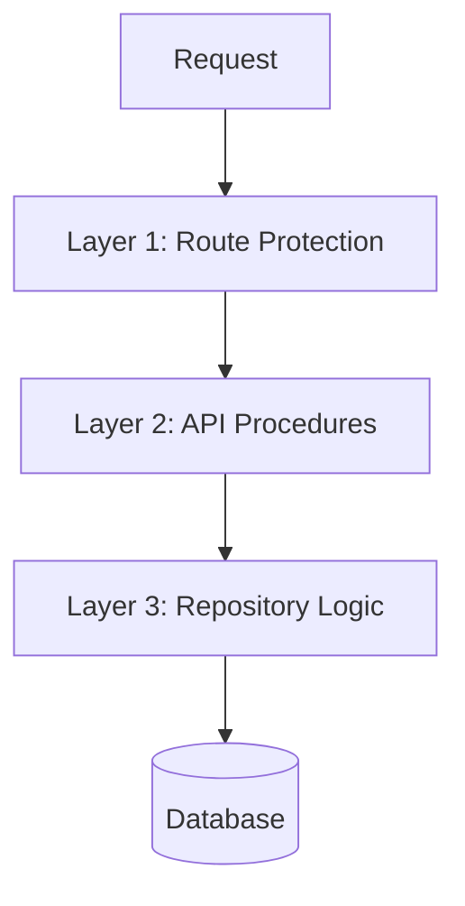

### Layer 1: Route Protection
Loaders check session before returning data. Unauthenticated users are redirected to login.

### Layer 2: API Procedures

| Procedure | Requirement |
|-----------|-------------|
| `publicProcedure` | None |
| `protectedProcedure` | Valid session |
| `adminProcedure` | Valid session + admin role |

### Layer 3: Repositories
Framework-agnostic data access. No auth logic — receives pre-validated user context.

## Role-Based Access Control

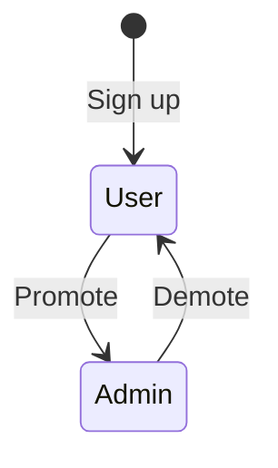

| Role | Permissions |
|------|------------|
| User | Read/write own resources |
| Admin | Full access + user management |

## Input Validation

| Layer | Tool | Purpose |
|-------|------|---------|
| API | Zod schemas | Request input validation |
| Database | ORM constraints | Data integrity |
| Client | Form validation | UX feedback |

## Secrets

| Environment | Storage |
|-------------|---------|
| Local | `.dev.vars` or `.env` |
| Production | Platform secrets manager |

**Rule:** Never use `process.env` if running on edge/serverless. Access env through runtime context.
```

#### user-journeys.md — User Journeys

```markdown
---
title: User Journeys
date: YYYY-MM-DD
---

# User Journeys

## Authentication

### Sign Up

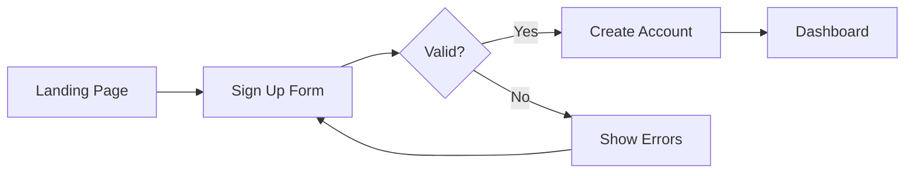

**Key files:** `app/routes/signup.tsx`, `app/auth/`

### Login

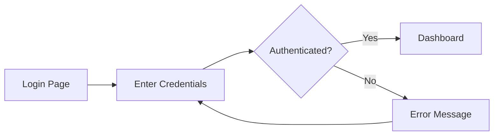

**Key files:** `app/routes/login.tsx`, `app/auth/`

### Logout

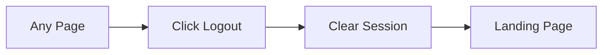

## Core User Journeys

### Primary Flow Name

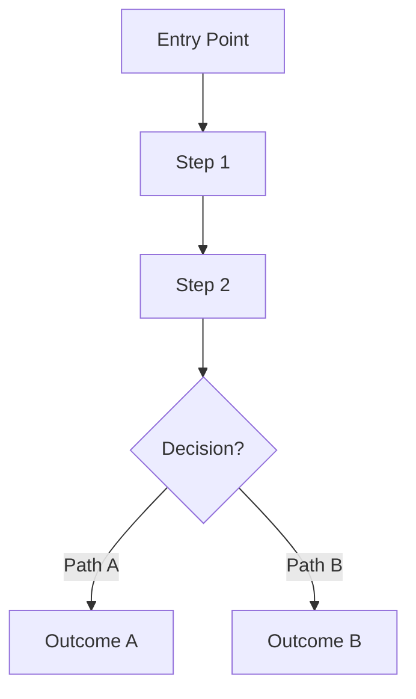

**Key files:** `relevant/file/paths`

## Admin Journeys

### User Management

```mermaid
flowchart LR
  Admin[Admin Panel] --> Users[User List]
  Users --> View[View User]
  View --> Actions{Action}
  Actions --> Ban[Ban User]
  Actions --> Promote[Change Role]
```

**Key files:** `app/routes/admin/`

## Route Access

```mermaid
flowchart TD
  Request[Request] --> Auth{Authenticated?}
  Auth -->|No| Public{Public Route?}
  Public -->|Yes| Render[Render Page]
  Public -->|No| Redirect[Redirect to Login]
  Auth -->|Yes| Admin{Admin Route?}
  Admin -->|No| Render
  Admin -->|Yes| IsAdmin{Is Admin?}
  IsAdmin -->|Yes| Render
  IsAdmin -->|No| Forbidden[403]
```

## Error States

```mermaid
stateDiagram-v2
  [*] --> Normal
  Normal --> NetworkError: Connection lost
  Normal --> AuthError: Session expired
  Normal --> NotFound: Invalid route
  Normal --> ServerError: 500
  NetworkError --> Normal: Retry
  AuthError --> Login: Redirect
  NotFound --> Normal: Navigate
  ServerError --> Normal: Retry
```
```

---

## Maintenance Mode

### Adding a Feature Document
1. Create `docs/features/{feature-name}.md` or `docs/features/{feature-name}-architecture.md`
2. Use the **Feature Architecture** template below
3. Add feature summary to `docs/architecture/features.md`

### Adding an Implementation Plan
1. Create `docs/plans/{feature}-implementation.md`
2. Use the **Implementation Plan** template below

### Adding Release Notes
1. Create `docs/releases/YYYY-MM-DD-{title}.md`
2. Use the **Release Notes** template below
3. Add changelog entry to `docs/architecture/overview.md`

### Adding a Testing Plan
1. Create `docs/testing/{feature}/` folder with `screenshots/` subfolder
2. Add `{feature}.md` testing plan using the **Testing Plan** template
3. Save screenshots to `screenshots/` subfolder

### Adding Meeting Notes
1. Create `docs/meetings/YYYY-MM-DD-{description}.md`
2. Use the **Meeting Notes** template below

### Adding Research
1. Create `docs/research/{topic}-research.md`
2. Use the **Research** template below

### Adding a Design Spec
1. Create `docs/design/{spec-name}.md`
2. Use the **Design Specification** template below

### Adding a Review
1. Create `docs/reviews/{review-type}-{subject}.md`
2. Use the **Review** template below

### Adding a Guide
1. Create `docs/guides/{topic}-guide.md`
2. Use the **Guide** template below

### Updating Architecture Context
When making significant changes, update the relevant `docs/architecture/` file(s):
- New API routes → `api.md`
- Schema changes → `data-models.md`
- New features → `features.md` + `overview.md` changelog
- New integrations → `integrations.md`
- Auth/security changes → `security.md`
- New user flows → `user-journeys.md`
- Architecture refactor → `system.md` + `overview.md`

---

## Document Templates

### Feature Architecture

```markdown
---
title: Feature Name Architecture
date: YYYY-MM-DD
---

# Feature Name

## Overview

### Vision
Brief description of what this feature does and why it exists.

### Core Value Proposition
What problem does this solve for users?

## User Flow

### Primary Flow

(Include a Mermaid flowchart if applicable)

## System Architecture

### High-Level Architecture

(Include a Mermaid diagram showing component relationships)

## Data Model

### Entity Relationships

(Include ER diagram and/or TypeScript interfaces)

## Feature Breakdown

### Feature 1
Description, behavior, and edge cases.

### Feature 2
Description, behavior, and edge cases.

## UI Components

### Component Hierarchy
Describe the component tree and responsibilities.

## Technical Stack

### API Endpoints

| Endpoint | Method | Description |
|----------|--------|-------------|
| `/api/...` | GET | Description |

### Key Files

| File | Purpose |
|------|---------|
| `path/to/file` | Description |

## Implementation Checklist

- [ ] Task 1
- [ ] Task 2

## Future Roadmap

- Potential enhancement 1
- Potential enhancement 2
```

### Implementation Plan

```markdown
---
title: Feature Name Implementation Plan
date: YYYY-MM-DD
---

# Feature Name Implementation

## Status
In Progress | Completed | Draft

## Overview
What this plan covers and the goals.

## Phases

### Phase 1: Foundation
- [ ] Task 1
- [ ] Task 2

### Phase 2: Core Features
- [ ] Task 1
- [ ] Task 2

### Phase 3: Polish
- [ ] Task 1
- [ ] Task 2

## Files Created/Modified

| File | Change |
|------|--------|
| `path/to/file` | Description |

## Validation Checklist

- [ ] All tests passing
- [ ] Build succeeds
- [ ] Feature works end-to-end
```

### Release Notes

```markdown
---
title: Release Title
date: YYYY-MM-DD
---

# Release Title

## Summary
Brief overview of what changed.

## New Features
- Feature 1: description
- Feature 2: description

## Key Files

| File | Description |
|------|-------------|
| `path/to/file` | What it does |

## Bug Fixes
- Fix 1: description

## Breaking Changes
None.

## Dependencies Added
None.
```

### Testing Plan

```markdown
---
title: Testing Plan - Feature Name
date: YYYY-MM-DD
---

# Testing Plan: Feature Name

## Overview
What was implemented and needs testing.

## Prerequisites
- [ ] Dev server running
- [ ] Test data available

## Test Scenarios

### Scenario 1: Happy Path
**Steps:**
1. Navigate to URL
2. Perform action
3. Verify result

**Expected:** Describe expected outcome

**Screenshot:** 

### Scenario 2: Edge Case
**Steps:**
1. Step 1
2. Step 2

**Expected:** Describe expected outcome

## UI Elements to Verify

| Element | Expected State |
|---------|---------------|
| Button | Enabled, correct label |

## Test IDs Reference

| Element | Test ID |
|---------|---------|
| Submit button | `data-testid="submit-btn"` |

## Issues Found

| # | Description | Severity | Status |
|---|-------------|----------|--------|
| 1 | Description | High/Med/Low | Open/Fixed |

## Next Steps
- [ ] Action item 1
- [ ] Action item 2
```

### Meeting Notes

```markdown
---
title: Meeting Title
date: YYYY-MM-DD
---

# Meeting Title

**Date:** YYYY-MM-DD
**Attendees:** Names

## Agenda
1. Topic 1
2. Topic 2

## Discussion

### Topic 1
Key points discussed.

### Topic 2
Key points discussed.

## Action Items
- [ ] @person - Task description (due date)

## Next Meeting
Date and planned topics.
```

### Research

```markdown
---
title: Topic Research
date: YYYY-MM-DD
---

# Topic Research

## Executive Summary
Brief summary of findings and recommendations.

## Research Objectives
What questions this research aims to answer.

## Methodology
How the research was conducted (competitor analysis, user interviews, etc.)

## Findings

### Finding 1: Title
Analysis and evidence.

### Finding 2: Title
Analysis and evidence.

## Competitor Analysis

| Competitor | Strength | Weakness | Relevance |
|------------|----------|----------|-----------|
| Name | Detail | Detail | High/Med/Low |

## Key Takeaways
1. Takeaway 1
2. Takeaway 2

## Recommendations
1. Recommendation with rationale
2. Recommendation with rationale

## Sources
- Source 1
- Source 2
```

### Design Specification

```markdown
---
title: Design Spec Name
date: YYYY-MM-DD
---

# Design Spec Name

## Summary
One paragraph describing the design direction.

## Research Sources
- Reference 1
- Reference 2

## Core Principles
1. Principle 1: description
2. Principle 2: description

## Visual Language

### Typography
Font choices, scale, and hierarchy.

### Color Palette
Primary, secondary, accent, and semantic colors.

### Spacing & Layout
Grid system, spacing scale, and layout patterns.

### Motion & Interaction
Animation principles, transitions, and interaction patterns.

## Component Specifications

### Component 1
Visual spec, states, and behavior.

### Component 2
Visual spec, states, and behavior.

## Do's and Don'ts

### Do
- Guidance 1
- Guidance 2

### Don't
- Anti-pattern 1
- Anti-pattern 2

## References
- Industry examples and inspiration
```

### Review

```markdown
---
title: Review Type - Subject
date: YYYY-MM-DD
---

# Review: Subject

## Plan Alignment

| Requirement | Status | Notes |
|-------------|--------|-------|
| Requirement 1 | Met / Partial / Not Met | Details |

## Implementation Quality

### Architecture
Assessment of architectural decisions.

### Code Quality
Assessment of code patterns, DRY, naming.

### Performance
Assessment of performance implications.

### Security
Assessment of security considerations.

## Recommendations

### Must Fix (Blockers)
1. Issue and remediation

### Should Improve
1. Improvement suggestion

### Nice to Have
1. Enhancement idea

## Summary
Overall assessment and verdict.
```

### Guide

```markdown
---
title: Topic Guide
date: YYYY-MM-DD
---

# Topic Guide

## Executive Summary
What this guide covers and who it's for.

## Background
Context needed to understand the guide.

## Step-by-Step

### Step 1: Title
Detailed instructions with code examples.

### Step 2: Title
Detailed instructions with code examples.

### Step 3: Title
Detailed instructions with code examples.

## Lessons Learned
Key insights from the implementation.

## Replication Instructions
How to apply this pattern to a new feature/project.

## Troubleshooting

| Problem | Solution |
|---------|----------|
| Issue 1 | Fix 1 |

## References
- Related docs and resources
```

---

## Formatting Standards

1. Use **H1** for the main title, **H2** for sections, **H3** for subsections
2. Include **Mermaid diagrams** for complex flows and architecture — lead with visuals, not prose
3. Use **tables** for structured data (file lists, comparisons, checklists)
4. Use `- [ ]` for action items and checklists
5. Always specify language in fenced code blocks
6. Link to related docs within the same `docs/` tree
7. Keep prose minimal — 1-3 sentences per section, then use diagrams/tables

## Document Lifecycle

Features typically flow through this documentation chain:

```
research/ --> design/ --> features/ --> plans/ --> (implementation) --> reviews/ --> testing/ --> releases/
     \                                                                                          /
      `----------------------------> architecture/ (updated continuously) <--------------------'
```

- **Research** informs design decisions
- **Design specs** guide feature architecture
- **Feature docs** define what to build
- **Plans** break work into phases
- **Reviews** validate against plans
- **Testing plans** verify the implementation
- **Release notes** summarize what shipped
- **Guides** capture reusable lessons
- **Architecture** is the living system-of-record, updated at every stage
